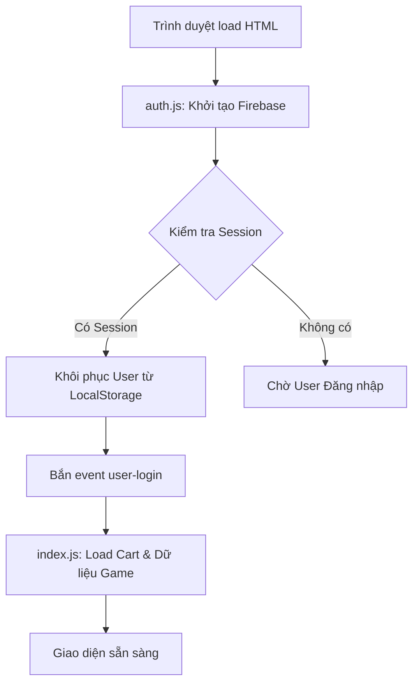

# 📚 Tài liệu Cấu trúc JavaScript Chi tiết - NeonNexus

Tài liệu này cung cấp cái nhìn sâu sắc về kiến trúc, luồng dữ liệu và các chức năng chi tiết của hệ thống JavaScript trong dự án NeonNexus.

---

## 🏗️ 1. Kiến trúc Tổng quan

NeonNexus sử dụng mô hình **Vanilla JS** kết hợp với **Firebase Compat SDK (v10)**. Hệ thống được thiết kế để chạy mượt mà trên cả môi trường web (Firebase Hosting) và môi trường offline (file://).

### 🔄 Luồng Khởi tạo (Startup Flow)

---

## 📂 2. Chi tiết các Module API (`/API`)

### 🔐 2.1. `auth.js` (Trái tim của Hệ thống)
Tệp này chịu trách nhiệm thiết lập toàn bộ kết nối với Firebase và quản lý danh tính người dùng.

*   **Firebase Compat Shim**: Chuyển đổi các lệnh Modular (v9+) sang Compat (v8) để code ổn định và dễ bảo trì.
*   **Các hàm quan trọng:**
    *   `startFirebaseSafe()`: Tự động kiểm tra và chèn các thẻ `<script>` Firebase nếu trang web chưa có. Đảm bảo Firebase luôn sẵn sàng.
    *   `serializeDashboardUser(source)`: Chuẩn hóa dữ liệu người dùng từ nhiều nguồn (Google, Steam, Guest) thành một định dạng chung.
    *   `updateUI(user)`: Cập nhật Avatar và tên trên Header. Xử lý logic hiển thị ảnh Profile mặc định cho Guest.
    *   `handleSteamLogin()`: Mở cửa sổ popup để xác thực qua Steam.
    *   `checkAuthStatus()`: Lắng nghe thay đổi trạng thái từ Firebase Auth (`onAuthStateChanged`).

### 🛒 2.2. `index.js` (Quản lý Cửa hàng & Giỏ hàng)
Điều khiển toàn bộ trải nghiệm mua sắm trên trang chủ.

*   **Smart API Base Detection**: Hàm `getAPIBase()` tự động phát hiện nếu đang chạy ở `localhost:5000` (server node) hay trên Firebase để gọi API đúng chỗ.
*   **Quản lý Giỏ hàng (Cart Logic):**
    *   `saveCart()` & `loadCart()`: Đồng bộ giỏ hàng giữa `localStorage` (cho Guest) và `Firestore` (cho User đã đăng nhập).
    *   `addToCart(game)`: Kiểm tra nếu là Guest thì hiện Modal yêu cầu đăng nhập trước khi mua.
*   **Hiển thị Sản phẩm:**
    *   `renderProducts()`: Sử dụng cơ chế **Inline OnError** (`errHandler`) để xử lý ảnh lỗi. Nếu ảnh chính lỗi, nó sẽ tự động thử ảnh fallback 1, rồi fallback 2, cuối cùng là ảnh placeholder.
*   **Checkout**: Tích hợp thanh toán đa phương thức (Stripe, MoMo, ZaloPay, VietQR).

### 👤 2.3. `account.js` (Hồ sơ & Lịch sử Đơn hàng)
Quản lý dữ liệu cá nhân và các sản phẩm đã mua.

*   **Membership System**:
    *   `renderMembership(data)`: Tính toán cấp bậc thành viên (Silver, Gold, Platinum, Diamond) dựa trên tổng số tiền đã chi tiêu (`totalSpent`).
    *   Tự động cập nhật thanh tiến trình (Progress Bar) và thông báo số tiền cần nạp thêm để lên cấp.
*   **Lịch sử Key**:
    *   `loadUserKeys(userId)`: Sử dụng **Real-time Listener** (`onSnapshot`) từ Firestore. Khi bạn mua hàng thành công, Key sẽ xuất hiện ngay lập tức trên trang Account mà không cần load lại trang.
    *   `copyKey(elementId)`: Hỗ trợ copy mã key nhanh vào Clipboard.

### 🌐 2.4. `path-resolver.js` (Giải quyết Đường dẫn)
Đây là "vị cứu tinh" giúp dự án chạy được ở mọi nơi.

*   **`PathResolver.resolve(target)`**:
    *   Nếu là **Firebase**: Giữ nguyên đường dẫn ảo (VD: `/trending`).
    *   Nếu là **Localhost**: Chuyển sang đường dẫn vật lý (VD: `/html/trending.html`).
    *   Nếu là **File://**: Thêm tiền tố `../` hoặc `./` tùy vào cấp độ thư mục hiện tại.
*   **Auto-Fix Links**: Tự động tìm tất cả thẻ `<a>` có `href` bắt đầu bằng `/` và sửa lại cho đúng môi trường.

---

## 📡 3. Giao tiếp giữa các File (Events)

Dự án sử dụng `CustomEvent` để các file JS khác nhau có thể "nói chuyện" với nhau mà không bị phụ thuộc cứng (Decoupling).

1.  **`user-login`**: Bắn ra bởi `auth.js` khi đăng nhập thành công. `index.js` và `account.js` sẽ lắng nghe để tải giỏ hàng/dữ liệu người dùng tương ứng.
2.  **`user-logout`**: Bắn ra khi đăng nhập. Xóa dữ liệu tạm thời và reset giao diện.
3.  **`dashboard-language-change`**: Cập nhật lại các chuỗi văn bản khi người dùng đổi ngôn ngữ.

---

## 🛠️ 4. Công nghệ sử dụng

*   **Icons**: [Lucide Icons](https://lucide.dev/) - Được khởi tạo lại qua `lucide.createIcons()` mỗi khi DOM thay đổi động.
*   **Payment**: Stripe SDK (v3) & Custom QR Generator cho VietQR.
*   **Styling**: Hệ thống CSS biến (Variables) đồng bộ với trạng thái Dark/Light mode qua `theme-toggle.js`.
*   **Data Source**: Kết hợp giữa Firebase Firestore (dữ liệu người dùng) và CheapShark API (dữ liệu game).

---

## 💡 Lưu ý cho Lập trình viên

*   **Global Access**: Các biến bắt đầu bằng `window.__` (như `window.__firebaseAuth`) là các biến toàn cục quan trọng. Tránh ghi đè lên chúng.
*   **Guest Mode**: Hệ thống phân biệt Guest qua tiền tố `guest_` trong ID. Dữ liệu của Guest chỉ lưu ở trình duyệt khách, không đẩy lên database để bảo mật và tiết kiệm tài nguyên.
*   **Race Condition**: Luôn sử dụng `window.waitForFirebaseAuth()` nếu bạn cần thực hiện các lệnh liên quan đến database ngay khi trang web vừa load.
