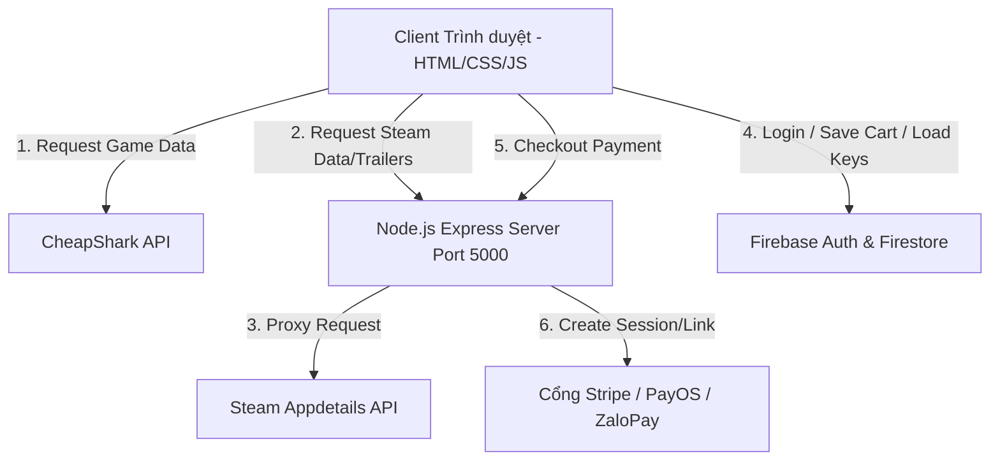

# 🌌 BẢN PHÂN TÍCH VÀ GIẢI THÍCH CHI TIẾT TOÀN BỘ HỆ THỐNG NEONNEXUS

Tài liệu này giải thích chi tiết nhất có thể về tất cả các thành phần công nghệ, mã nguồn (HTML, CSS, JS), cơ sở dữ liệu Cloud Firestore, các tích hợp API thanh toán (Stripe, PayOS, ZaloPay), xác thực Steam OpenID và các công cụ đóng gói được sử dụng trong dự án **NeonNexus - Cyberpunk Digital Game Store**.

---

## 💻 1. KIẾN TRÚC MÔ HÌNH HỆ THỐNG (ARCHITECTURE FLOW)

Hệ thống hoạt động trên mô hình Client-Server tương tác động:



---

## 📂 2. CẤU TRÚC CHI TIẾT CÁC FILE GIAO DIỆN & MÃ NGUỒN HTML

Dự án gồm **13 file HTML**. Dưới đây là mô tả chi tiết cấu trúc thẻ và vai trò của từng trang:

### 1. index.html - Trang Chủ Cổng Thông Tin
*   **Hero Carousel:** Khung chứa slide tự động chạy hiển thị poster game định dạng lớn. Dùng nút `#carousel-prev` và `#carousel-next` để chuyển động thủ công, liên kết trực tiếp sang Steam Store bằng App ID tương ứng.
*   **Quick Categories Nav:** Bộ nút lựa chọn thể loại game nhanh (`#categories-container`) giúp lọc nhanh game theo danh mục (Action, RPG, Shooter, Indie, Open World).
*   **Lưới sản phẩm chính (`#products-grid`):** Nơi render các thẻ game động từ JS.
*   **Thanh Trượt Giỏ Hàng (`#cart-drawer`):**
    *   Hộp thoại ẩn hiện từ lề phải màn hình nhờ class `.active`.
    *   Chứa danh sách game đã chọn (`#cart-items-container`), dòng nhập mã giảm giá, hiển thị cấp VIP thành viên (`#cart-membership-tier`), dòng hiển thị mức giảm giá tương ứng (`#cart-discount-value`), tổng tiền thanh toán (`#cart-total`) và các nút chọn thanh toán.

### 2. html/store.html - Cửa Hàng Trực Tuyến
*   **Thanh tìm kiếm nâng cao (`#search-input`):** Tìm kiếm dạng nhập đến đâu tìm đến đó (Debounce search).
*   **Bộ lọc thể loại game (`#genre-filter`):** Select box chứa các thể loại game từ CheapShark API.
*   **Nút nạp thêm game (`#load-more-btn`):** Gọi hàm phân trang để tải tiếp 30 game tiếp theo.

### 3. html/trending.html - Bảng Xếp Hạng Xu Hướng
*   **AAA New Releases:** Khu vực hiển thị game bom tấn mới ra mắt năm 2026.
*   **AAA Classics:** Khu vực hiển thị game bom tấn kinh điển.
*   **Trailer Modal (`#trailer-modal`):** Hộp thoại pop-up chứa thẻ `<iframe>` tự động nạp video trailer khi người dùng bấm nút xem trailer game.

### 4. html/event.html - Sự Kiện & Flash Sales
*   **Countdown Clock (`#countdown`):** Đồng hồ đếm ngược hiển thị giờ, phút, giây tự giảm dần về 0 bằng hàm `setInterval` trong JS.
*   **Flash Sale Grid:** Hiển thị thẻ game giảm giá sâu nạp trực tiếp từ dữ liệu ưu đãi nổi bật của Steam Store.

### 5. html/community.html - Hoạt Động Cộng Đồng
*   **Create Post Form:** Khung cho phép người dùng soạn thảo và gửi bài viết của mình lên bảng tin chung.
*   **Bảng tin chính (`#posts-feed`):** Danh sách các bài đăng nạp động từ Firestore hỗ trợ đếm Like và bình luận.
*   **Sidebar Tin Tức (`#news-feed`):** Tự động tải RSS feed tin tức game mới nhất từ Steam qua server.

### 6. html/account.html - Trang Quản Lý Tài Khoản
*   **VIP Badge Dashboard:** Hiển thị cấp độ thẻ VIP (Silver, Gold, Platinum, Diamond) với màu sắc neon tương ứng dựa trên tổng số tiền người dùng đã tích lũy.
*   **Order History List (`#keys-list`):** Danh sách toàn bộ các hóa đơn đã mua, click vào từng hóa đơn để mở rộng xem mã Key game kích hoạt đã nhận.

### 7. html/keygen.html - Trình Phát Sinh Mã Key Game
*   **Màn hình nhận Key:** Sau khi người dùng thanh toán qua cổng điện tử, họ sẽ được chuyển về đây.
*   **Mã Cyber-Key Generator:** Chạy hiệu ứng số chạy ngẫu nhiên trước khi dừng lại hiển thị Key chính thức định dạng `NEXUS-XXXX-XXXX-XXXX`. Đồng bộ key này vào Cloud Firestore của người dùng.

### 8. html/support.html - Liên Hệ Hỗ Trợ Kỹ Thuật
*   **Form Hỗ Trợ:** Gồm ô nhập Họ tên, Email, Tiêu đề và nội dung cần hỗ trợ. Có validate kiểm tra dữ liệu trước khi dùng Firebase ghi tài liệu vào DB.

### 9. html/privacy_policy.html & html/terms_of_service.html - Văn bản pháp lý và bảo mật

### 10. html/debug-steam.html - Bảng điều khiển kiểm tra đăng nhập Steam dành cho kỹ thuật viên.

### 11. profile.html - Giao diện Hồ sơ Developer cá nhân hóa
*   Thiết kế giao diện dạng bảng điều khiển máy tính tương lai (sci-fi control panel) giới thiệu kỹ năng, các dự án và thông tin liên lạc của lập trình viên.

---

## 🎨 3. CHI TIẾT HỆ THỐNG STYLE CSS (DESIGN SYSTEM)

CSS được tổ chức theo cấu trúc kế thừa và phân mảnh tối ưu responsive:

### A. Tệp CSS lõi: css/index.css
*   **Hệ thống biến màu (CSS Variables):**
    ```css
    :root {
      --cyber-bg: #0a0a0f;       /* Nền đen sâu Cyberpunk */
      --neon-cyan: #00f0ff;     /* Xanh neon phản quang */
      --neon-pink: #ff0055;     /* Hồng neon rực rỡ */
      --neon-purple: #9d00ff;   /* Tím neon huyền bí */
      --glass-bg: rgba(10, 10, 15, 0.7); /* Nền kính mờ */
      --border-glow: 0 0 10px var(--neon-cyan); /* Viền phát sáng */
    }
    ```
*   **Hiệu ứng Kính Mờ (Glassmorphism):** Áp dụng trên giỏ hàng `#cart-drawer` và thẻ game `.product-card`. Sử dụng `backdrop-filter: blur(12px)` kết hợp viền mờ `border: 1px solid rgba(0, 240, 255, 0.15)` để tạo chiều sâu giao diện.
*   **Hiệu ứng Scanlines & Glitch:** Sử dụng giả lập dòng quét tivi cũ đè lên nền trang bằng gradient tuyến tính:
    ```css
    body::before {
      content: "";
      background: linear-gradient(rgba(18, 16, 16, 0) 50%, rgba(0, 0, 0, 0.25) 50%), linear-gradient(90deg, rgba(255, 0, 0, 0.06), rgba(0, 255, 0, 0.02), rgba(0, 255, 0, 0.06));
      background-size: 100% 4px, 6px 100%;
    }
    ```

### B. CSS Mobile & Giao Diện Sáng (Light Mode)
*   **Hệ thống CSS Mobile:** `account-mobile.css`, `community-mobile.css`, `event-mobile.css`, `trending-mobile.css`, và `discounts.css` (Style Flash Sales di động).
    *   Tất cả sử dụng truy vấn phương tiện `@media (max-width: 900px)` hoặc `@media (max-width: 768px)` để sắp xếp lại bố cục từ dạng lưới nhiều cột sang dạng cuộn 1 cột đứng nhằm tránh tràn màn hình ngang.
*   **Hệ thống CSS Light Mode:** `checkout-light-mode.css` và `discounts-light.css`.
    *   Ghi đè lại các biến màu sắc khi thẻ `body` được gán thuộc tính `data-theme="light"`. Biến nền chuyển từ màu tối sang màu sáng nhạt, màu chữ chuyển sang màu tối để đảm bảo độ tương phản dễ đọc dưới ánh sáng ban ngày.

---

## ⚡ 4. PHÂN TÍCH CHI TIẾT LOGIC JAVASCRIPT (CLIENT-SIDE)

Các tệp JavaScript điều khiển toàn bộ tương tác và kết xuất dữ liệu:

### 1. API/path-resolver.js - Điều Hướng Đường Dẫn Đa Môi Trường
*   **Mục tiêu:** Giúp code hoạt động trơn tru mà không bị lỗi liên kết 404 kể cả khi chạy offline qua tệp `file://` (double click file html để mở) hoặc chạy online qua máy chủ HTTP (Live Server, Firebase Hosting).
*   **Hàm chính:**
    *   `getBasePath()`: Đọc chuỗi đường dẫn thư mục hiện tại để xác định xem dự án đang nằm ở thư mục con nào trên máy tính.
    *   `resolve(target)`: Ánh xạ động.
        *   Nếu chạy trên Firebase Hosting: Trả về dạng `/target` (Firebase tự điều hướng bằng file `firebase.json`).
        *   Nếu chạy trên Localhost: Trả về dạng `/thư-mục-gốc/html/file.html`.
        *   Nếu chạy Offline (File protocol): Trả về dạng tương đối `../html/file.html` hoặc `./file.html` tùy vào thư mục hiện hành.
    *   `MutationObserver`: Tự động quét toàn bộ cây DOM của trang Web để phát hiện các thẻ `<a>` mới chèn động bằng Javascript, gọi hàm giải quyết đường dẫn ngay lập tức trước khi người dùng kịp bấm vào.

### 2. API/auth.js - Quản Lý Đăng Nhập & Đồng Bộ Firebase
*   **Mục tiêu:** Xử lý xác thực người dùng và liên kết cơ sở dữ liệu Firebase.
*   **Hàm chính:**
    *   `startFirebaseSafe()`: Kiểm tra sự tồn tại của biến `window.firebase`. Nếu thiếu (do mạng yếu không tải kịp file script ở thẻ head), nó tự tạo các phần tử `<script>` nạp động Firebase App, Auth, và Firestore SDK compat trực tiếp từ Google CDN. Sau đó mới gọi khởi tạo kết nối database.
    *   `window.firebaseCart.saveCart(userId, items)`: Ghi giỏ hàng hiện tại vào Firestore theo đường dẫn tài liệu: `users/{userId}/cart/data`.
    *   `window.firebaseCart.loadPurchasedKeys(userId, callback)`: Đăng ký một bộ lắng nghe thời gian thực `onSnapshot` lên bộ sưu tập hóa đơn `users/{userId}/keys`. Khi có bất kỳ thay đổi nào (ví dụ: người dùng vừa thanh toán xong và server ghi key vào DB), giao diện trang tài khoản sẽ tự động nạp key mới mà không cần F5 tải lại trang.
    *   `window.firebaseCart.getUserMembership(userId)`: Lấy ra lịch sử các đơn hàng cũ, cộng dồn toàn bộ số tiền thanh toán thành công `amount` để quy đổi ra thứ hạng VIP tương ứng và lưu trữ kết quả này vào cache.

### 3. API/index.js - Điều Hướng Sản Phẩm & Thanh Toán Trang Chủ
*   **Mục tiêu:** Quản lý sản phẩm trang chủ và kết nối các cổng thanh toán.
*   **Hàm chính:**
    *   `loadGames(pageNumber)`: Tải danh mục game. Nếu danh mục là game thường, nó gọi `CheapSharkAPI.getGames` để lấy dữ liệu. Nếu danh mục là Softwares/Giftcards, nó lấy dữ liệu cứng định nghĩa sẵn tại local. Quản lý việc đóng mở Spinner loading.
    *   `checkout()`: Khởi tạo thanh toán.
        *   Nó gửi giỏ hàng hiện tại lên Server Node.js (cổng 5000) thông qua API tương ứng (Stripe, PayOS, ZaloPay).
        *   Nhận về liên kết URL thanh toán từ server, rồi dùng `window.location.href` để điều hướng người dùng sang trang thanh toán chính thức của ngân hàng hoặc Stripe.

### 4. API/game-detail.js - Quản Lý Trang Chi Tiết Game
*   **Mục tiêu:** Kết xuất dữ liệu cấu hình, mô tả và trailer của game.
*   **Hàm chính:**
    *   `loadGameDetail()`: Lấy ID game từ thanh địa chỉ trình duyệt, gửi request lên CheapShark API để lấy thông tin chi tiết game. Sau đó lấy App ID của Steam có liên kết để gửi yêu cầu lên backend lấy dữ liệu mở rộng từ máy chủ Steam.
    *   `trySteamTrailerByIndex(index)`: Đọc mảng chứa các phim trailer (`movies`) được trả về từ Steam. Tạo thẻ iframe và phát video với cơ chế dự phòng tự động chuyển đổi định dạng (ưu tiên `movie_max_vp9.webm`, nếu lỗi chuyển sang `movie_max.mp4` hoặc đổi sang trailer kế tiếp). Nếu hoàn toàn không có trailer, tự động ẩn khung phát video và giữ ảnh bìa game nguyên bản.

---

## 💾 5. CẤU TRÚC CHI TIẾT CƠ SỞ DỮ LIỆU CLOUD FIRESTORE

Cơ sở dữ liệu được tổ chức dạng tài liệu phân cấp (Hierarchical Document Storage) phù hợp với quy tắc bảo mật của Firebase Rules:

```
users/ (Collection)
  ├── {userId}/ (Document - Mỗi người dùng có 1 Document ID duy nhất)
        ├── profile/ (Subcollection)
        │     └── data (Document)
        │           ├── displayName: "Nguyễn Văn A" (String)
        │           ├── photoURL: "https://lh3.googleusercontent.com/..." (String)
        │           ├── email: "anv@gmail.com" (String)
        │           ├── provider: "google" (String)
        │           ├── totalSpent: 12500000 (Number - Tổng tích lũy VND)
        │           └── updatedAt: Timestamp (Date)
        │
        ├── cart/ (Subcollection)
        │     └── data (Document)
        │           ├── items: [ (Array)
        │           │     ├── { dealID: "xYz123", title: "Hades II", price: "19.99", quantity: 1 }
        │           │     ]
        │           ├── steamId: "76561198000000000" (String - dùng cho đăng nhập Steam)
        │           └── updatedAt: Timestamp (Date)
        │
        └── keys/ (Subcollection)
              └── {orderId} (Document - ID đơn hàng thanh toán)
                    ├── orderId: "PAYOS12345" (String)
                    ├── games: ["Hades II", "Stardew Valley"] (Array)
                    ├── keys: ["NEXUS-A1B2-C3D4", "NEXUS-E5F6-G7H8"] (Array)
                    ├── amount: 450000 (Number - Tổng hóa đơn)
                    ├── paymentMethod: "payos" (String)
                    ├── purchaseDate: Timestamp (Date)
                    └── status: "completed" (String)
```

---

## 🖥️ 6. PHÂN TÍCH LOGIC CHI TIẾT PHÍA MÁY CHỦ (NODE.JS SERVER)

Toàn bộ logic backend được lập trình trong tệp tin server/server.js chạy trên môi trường Node.js:

### A. Luồng Đăng Nhập Steam OpenID 2.0
Quy trình xác minh danh tính người dùng bằng tài khoản Steam diễn ra như sau:

```
[Client]                      [Server Node.js]                   [Steam Community Server]
   |                                 |                                      |
   |---- 1. Click Steam Login ------>|                                      |
   |                                 |---- 2. Create RelyingParty --------->|
   |<--- 3. Redirect to Steam -------|                                      |
   |                                                                        |
   |==================== 4. User signs in on Steam =========================|
   |                                                                        |
   |-------------------- 5. Redirect back with Signature ------------------>|
   |                                 |                                      |
   |                                 |---- 6. Validate Signature ---------->|
   |                                 |<--- 7. Signature OK & Return ID -----|
   |<--- 8. Redirect back to App ----|                                      |
```

1.  Client gửi yêu cầu đăng nhập bằng Steam → Gọi API `GET /auth/steam`.
2.  Server khởi tạo đối tượng `RelyingParty` từ gói `openid` của Node.js, thiết lập địa chỉ nhận phản hồi (Return URL) là `http://localhost:5000/auth/steam/authenticate`.
3.  Server chuyển hướng trình duyệt của người dùng sang trang đăng nhập của Steam (`https://steamcommunity.com/openid`).
4.  Sau khi người dùng đăng nhập thành công trên Steam, Steam chuyển hướng trình duyệt quay trở lại Server Node.js kèm theo các tham số ký số để kiểm tra.
5.  Server gọi hàm kiểm tra chữ ký với Steam. Nếu đúng, Server bóc tách lấy ra mã **SteamID 64-bit** (chuỗi 17 chữ số) của người dùng.
6.  Server thực hiện chuyển hướng trình duyệt khách hàng trở lại giao diện Web kèm theo các tham số thông tin của tài khoản để phía Client lưu vào bộ nhớ trình duyệt.

### B. Proxy API Vượt Rào Lỗi CORS
*   Do cơ chế bảo mật của trình duyệt web (CORS), Client không thể trực tiếp gửi yêu cầu lấy dữ liệu từ tên miền `store.steampowered.com` của Steam.
*   Server Node.js cung cấp endpoint `GET /api/steam/appdetails`. Khi Client gửi mã game lên đây, Server chạy thư viện `axios` để tải dữ liệu trực tiếp ở phía Backend từ máy chủ Steam, sau đó đóng gói kết quả và trả về cho Client. Vì Backend gọi Backend nên hoàn toàn không bị chặn CORS.

### C. Cơ Chế Xử Lý Thanh Toán (Payment Gateways)

#### 1. Tích hợp Stripe Checkout (`POST /api/payment/stripe`)
*   Server dùng khóa bí mật `STRIPE_SECRET_KEY` khởi tạo Stripe SDK.
*   Server nhận giỏ hàng từ Client, duyệt qua từng món hàng và tạo cấu trúc sản phẩm phù hợp cho Stripe:
    ```javascript
    const line_items = items.map(item => ({
      price_data: {
        currency: 'usd',
        product_data: { name: item.title },
        unit_amount: Math.round(item.price * 100), // Quy đổi sang cent
      },
      quantity: item.quantity,
    }));
    ```
*   Server gọi `stripe.checkout.sessions.create()` để tạo phiên thanh toán trên máy chủ Stripe. Trả về đường dẫn hóa đơn thanh toán cho Client tự chuyển hướng.

#### 2. Tích hợp PayOS Chuyển Khoản Ngân Hàng (`POST /api/payment/payos`)
*   Server sử dụng bộ SDK `@payos/node` cấu hình bằng `PAYOS_CLIENT_ID`, `PAYOS_API_KEY`, và `PAYOS_CHECKSUM_KEY`.
*   Khi có yêu cầu thanh toán, Server tạo payload đơn hàng gồm mã hóa đơn số, số tiền cần trả (VND) và tên các vật phẩm game.
*   Gọi hàm `payos.createPaymentLink(paymentBody)` để yêu cầu PayOS khởi tạo liên kết thanh toán VietQR động. Người dùng chỉ cần mở app ngân hàng quét mã QR này là chuyển tiền thành công. Trả liên kết QR về cho Client.

#### 3. Tích hợp ZaloPay Ví Điện Tử (`POST /api/payment/zalopay`)
*   Do không sử dụng SDK ngoài, Server tự xây dựng phương thức truyền tin an toàn theo cấu trúc API của ZaloPay:
    *   *Tham số cần thiết:* `app_id`, `app_user`, `app_trans_id` (mã giao dịch định dạng `yymmdd_xxxx`), `app_time` (mốc thời gian), `amount` (số tiền), `item` (giỏ hàng dạng chuỗi JSON), `embed_data` (dữ liệu kèm theo), `description`.
    *   *Thuật toán bảo mật tạo chữ ký số (Sign):* ZaloPay yêu cầu mã hóa để đảm bảo đơn hàng không bị giả mạo. Server Node.js sử dụng mô-đun mã hóa lõi `crypto` để băm dữ liệu theo thuật toán **HMAC-SHA256**:
        ```javascript
        const dataToSign = app_id + "|" + app_trans_id + "|" + app_user + "|" + amount + "|" + app_time + "|" + embed_data + "|" + item;
        const mac = crypto.createHmac('sha256', ZALOPAY_KEY1)
                          .update(dataToSign)
                          .digest('hex');
        ```
    *   Server gửi toàn bộ gói dữ liệu kèm chữ ký `mac` này lên máy chủ Sandbox của ZaloPay bằng giao thức HTTPS POST. Máy chủ ZaloPay kiểm tra chữ ký, nếu khớp sẽ tạo đơn hàng và trả về liên kết thanh toán cho Client.

---

## 📦 7. QUY TRÌNH ĐÓNG GÓI, BẢO MẬT & TRIỂN KHAI (BUILD TOOLS)

Khi chạy lệnh triển khai hoặc đồng bộ để chuẩn bị đưa trang web lên Firebase Cloud, hai công cụ đóng gói sau sẽ chạy tự động:

### A. Script Đồng Bộ Dữ Liệu (`sync-build.js`)
*   Script này tự động dọn dẹp và sao chép toàn bộ các tệp tài nguyên tĩnh dùng cho giao diện web (HTML, CSS, JS, Image, Font) từ thư mục làm việc gốc của nhà phát triển vào thư mục `firebase_build/public` (đây là thư mục được cấu hình phân phối chính thức của hosting). Nó bỏ qua các thư mục cài đặt nội bộ như `node_modules` hoặc `.git`.

### B. Script Nén & Làm Mờ Bảo Mật (`build-obfuscate.js`)
Sau khi đồng bộ tệp sang thư mục public, script này sẽ thực hiện tối ưu hóa sâu:
1.  **Nén mã nguồn HTML (`html-minifier-terser`):** Tự động loại bỏ mọi dấu xuống hàng dư thừa, khoảng trắng và các comment chú thích của lập trình viên trong toàn bộ các file `.html` giúp dung lượng file nhẹ tối đa để tải nhanh nhất có thể.
2.  **Làm mờ mã nguồn JS (`javascript-obfuscator`):** Để tránh việc người dùng xem mã nguồn F12 và lấy cắp mã thiết lập hoặc API Key của dự án, script này biên dịch lại code JS về dạng Hexadecimal, thay đổi toàn bộ tên biến thành các ký tự vô nghĩa (Ví dụ: biến `currentUser` thành `_0x4a2f`), sắp xếp lại logic điều hướng của code và mã hóa toàn bộ các chuỗi text thô thành các mảng băm chuỗi. Điều này giúp mã nguồn được bảo mật an toàn 100%.
